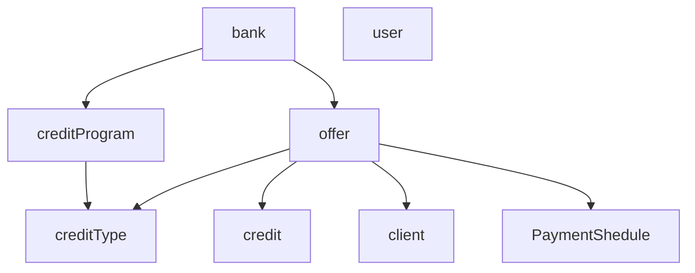

#  приложение JmixCreditApplication
## Описание 

JmixCreditApplication - это пример банковского приложения, где его пользователи - банковский персонал. JmixCreditApplication реализует
базовый набор возможностей, которые предоставляют крупные банковские приложения.

Приложение разработано с помощью плагина Jmix — набора библиотек и инструментов для ускорения разработки приложений Spring Boot.
Jmix предоставляет множество готовых к использованию функций из "корбки". Данный инструмент
подключает расширенные системные функции, такие как комплексная защита данных и аудит, а также бизнес-функции,
такие, как создание отчетов или механизм выполнения бизнес-процессов, с помощью нескольких строк кода.

## Бизнес-функциональность
Основная задача  проекта -  создать приложение для  банковских менеджеров и предоставить им функционал для оформления продуктов банка. Приложение предоставляет пользователям
разные уровни доступа - роли: Administrator и manager.

 Administrator -  имеет полный доступ к системным настройкам, а также ко всем  пользовательским возможностям приложения.
 
 Manager -  имеет уровень доступа к  регистрации клиента и оформлению банковского продукта, в системе приложения отображаются данные, созданные только самим пользователем.

* Приложение JmixCreditApplication предоставляет возможность регистрации клиента.  Его паспортные данные хранятся в другом приложении, тем самым обеспечивая сохранность данных.
* Существует гибкая настройка кредитной программы, предлагая широкий спектр банковских продуктов.
* На основе данных позволяет генерировать кредитные предложения, тем самым формируя график платежей.
* При сформированном кредитном предложении генерирует кредит для клиента банка.

## Модель данных
JmixCreditApplication основан на модели данных обычной системы управления банка.

User - класс, который представляет пользователя нашей программы. Основной целью которого является подтверждение доступа к системе.
Ссылки User на несколько Role объектов (физически не в базе данных, а концептуально через RoleAssignmentEntityfrom Jmix).

* bank (class) -  является логическим отображением банка.
* creditProgram (class) - сущность, содержащая  все основные атрибуты для оформления кредитной программы.
* creditType (enum) - представляет продукты кредитной программы.
* offer (class) - кредитное предложение, на основе собранных данных - формируются график платежей.
* paymentShedule(class) -  создаются в оффере, отображая платежную информацию.
* credit(class) - при успешной генерации офефра, создается кредит.
* client(class) - сущность, необходимая для регистрации и отслеживания клиентов.
  
## Безопасность

В примере с JmixCreditApplication для разных групп пользователей используются разные разрешения для безопасности, чтобы пользователи могли видеть только те данные и использовать функции, которые им разрешены.

Для достижения этой цели используется подсистема Jmix. В пакете io.jmix.bookstore.security определены различные роли времени разработки.

Сотрудники обычно получают одну из следующих функциональных/ресурсных ролей:

ManagerResourceRole - базовая роль для всех сотрудников, чтобы получить базовый доступ к системе
разрешение на чтение основных данных, таких как сотрудники, банки, кредит, кредитные программы.
Разрешения пользовательского интерфейса для общих экранов пользовательского интерфейса.

FullAccessRole - Роль для административных пользователей без каких-либо ограничений.

## Дополнение

Для полноценного запуска проекта необходимо использовать вспомогательный проект, который отвечает за доставку  и хранение  PassportDto:
https://github.com/yaryiYA/passportApp
