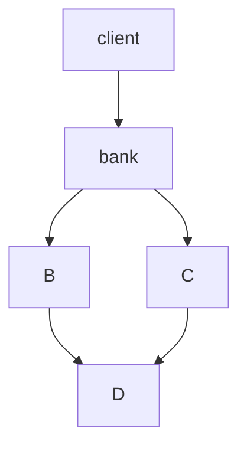

#  приложение JmixCreditApplication
## Описание 

JmixCreditApplication - это  прмер банковского приложения, где его пользователями является банковский пероснал. JmixCreditApplication реализует
базовый набор возможностей, которые предоставляют крупные банковсике приложения.

Приложение разработано с помощью плагина Jmix — набора библиотек и инструментов для ускорения разработки приложений Spring Boot. 
Jmix предоставляет множество готовых к использованию функций из коробки.Данный инструмент
подключить расширенные системные функции, такие как комплексная защита данных и аудит, а также бизнес-функции, 
такие как создание отчетов или механизм выполнения бизнес-процессов, с помощью нескольких строк кода.

## Бизнес-функциональность
* Приложение JmixCreditApplication предоставляет возмонжность регистрации клиента.Его паспортные данные хранятся в другом приложении, тем самым обеспечивая сохранность данных.
* Существует гибкая настройка кредитной программы, предлогая широкий спеткр банковских продуктов.
* На основе данных позволяет генерировать кредитные предложения, тем самым формируя график платежей.
* При сформированном кредитном предложении генериует кредит для  клиента банка.

## Модель данных

## Безопасность

В примере с JmixCreditApplication для разных групп пользователей используются разные разрешения для безопасности,чтобы пользователи могли видеть только те данные и использовать функции, которые им разрешены.

Для достижения этой цели используется подсистема Jmix. В пакете io.jmix.bookstore.security определены различные роли времени разработки.
